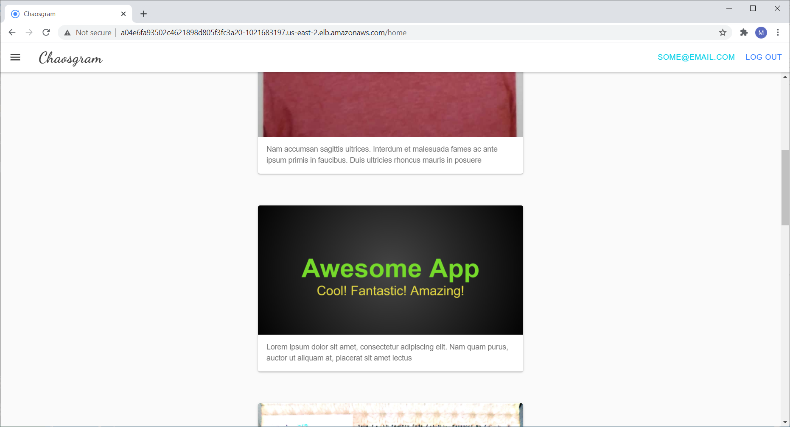
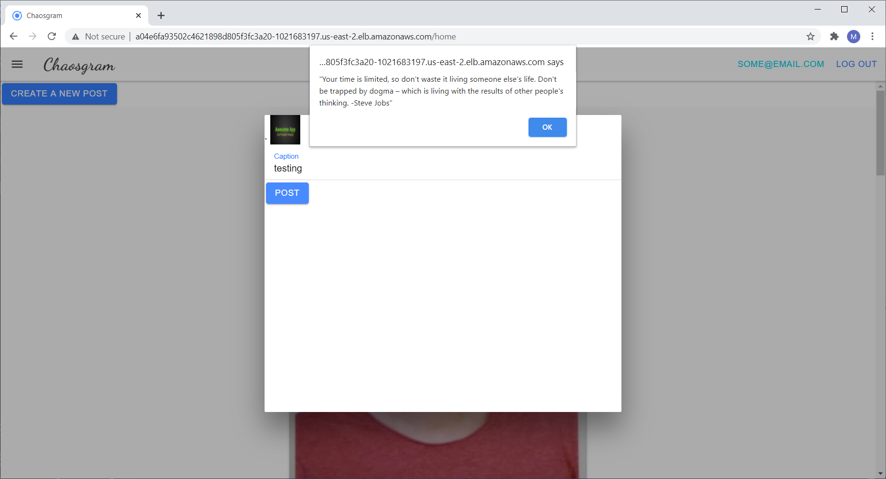
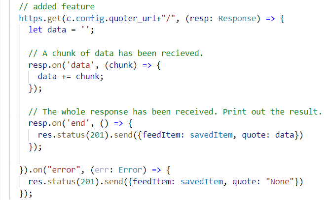
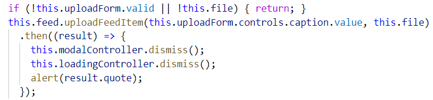
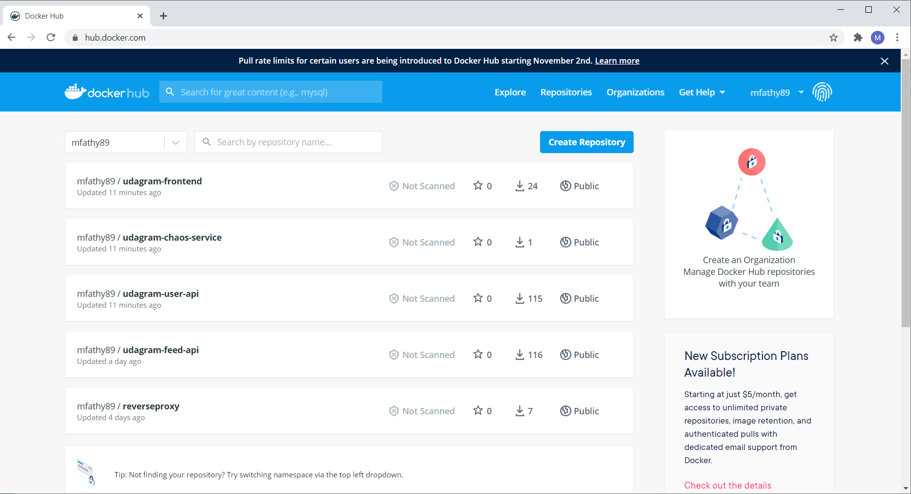
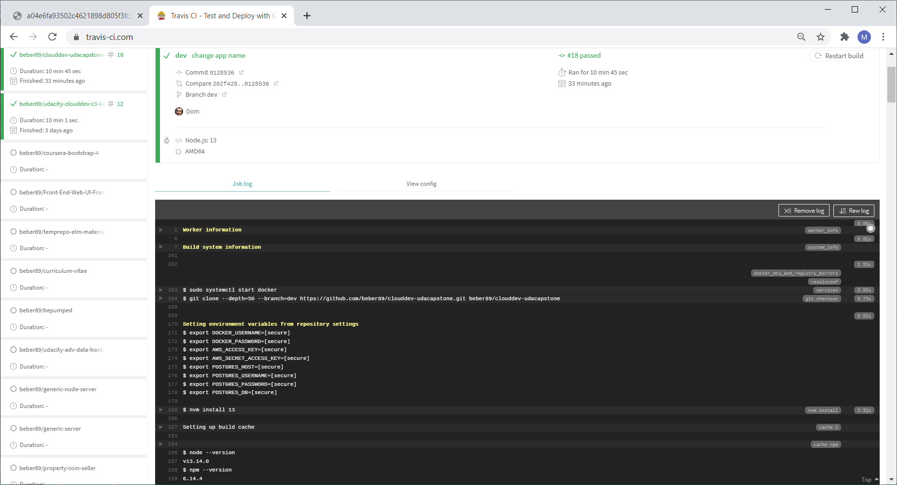
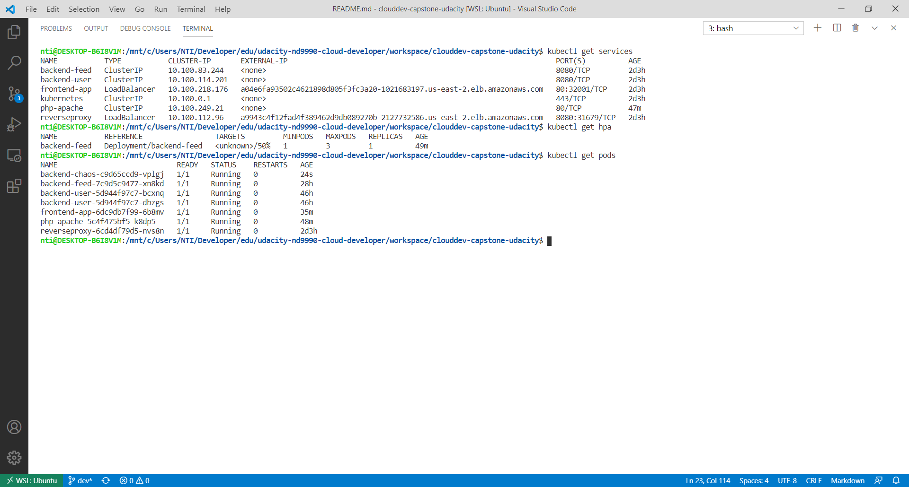

## About Application
- [https://github.com/beber89/clouddev-udacapstone](https://github.com/beber89/clouddev-udacapstone)
- Chaosgram, allows users to share photos and allows developers to mess up users' captions.
- You can open it from this url:
[a04e6fa93502c4621898d805f3fc3a20-1021683197.us-east-2.elb.amazonaws.com](a04e6fa93502c4621898d805f3fc3a20-1021683197.us-east-2.elb.amazonaws.com)



- It also presents a quote for the user whenever s/he uploads a new post.




## Composition
- The app comprises 4 microservices running in a container and one lambda function interfaced by AWS API Gateway.
  - frontend-app
  - backend-feed
  - backend-user
  - backend-chaos
  - lambda-quoter
- User uses the app by accessing `frontend-app` container.
- Two services `backend-feed` and `backend-user` communicates with `frontend-app`.
- The lambda function is only communicating with `backend-feed`.
- The `backend-chaos` is an isolated container only accessing the database (RDS) in order to change the captions.

## Added Feature
### Chaotic Caption Changes
- Container `backend-chaos` changes a random post's caption each 30 seconds.
### Random Quote Alert
- A lambda function is implemented with the role to send a quote to user whenever a post is uploaded
#### It takes quote request from feed backend
- 
#### Edits in frontend
- Backend sends the quote to frontend which presents it as an alert to user after the user successfully creates a new post.
- 


## Rubric
### Containers and Microservices
- Applications separated each on its container: frontend, backend-feed, backend-user, backend-chaos.
- Also one lambda function acting as a separated service.



### Independent Releases and Deployments
- Continuous Integration including tests described in `.travis.yml`.



### Service Orchestration with Kubernetes
- Application deployed as spearate components via kubernetes each in its own container.




## Testing
- Installed extra dev dependencies `@types/chai` & `@types/chai-http` in order to write tests in typescript.
- Added the run test script in `package.json` 
```
"test": "mocha -r ts-node/register src/**/*.spec.ts"
```
- Refactored `server.ts` to make it suited for testing as it needs to be imported by the test file.
- Created an RDS for testing with predetermined records to make testing easier.
- In travis-ci, Environment Variables for test added in the repository settings.
- Test shell Script `git_test.sh` is run in travis-ci VM.
- If testing fails the pipline is interrupted and new containers are not pushed onto the registry.
- Tests were written also for the `lambda-quoter` and `backend-chaos`.